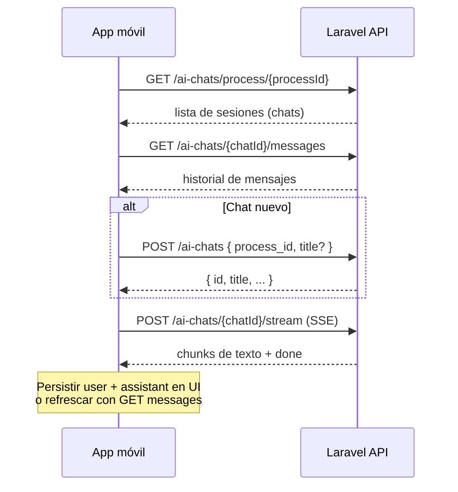

# API Lexa — Chat de IA (referencia para app móvil)

Documento derivado del frontend Angular (`AiChatService`, `AiVoiceChatService`, `ProcessAiChatComponent`). Describe cómo **listar chats**, **listar mensajes** y **enviar mensajes** contra Laravel.

---

## Base URL y autenticación

| Variable (frontend) | Ejemplo |
|---------------------|---------|
| `NG_APP_API_BASE_URL` | `https://tu-dominio.com/api/app-user` |

Todos los endpoints de chat cuelgan de:

```text
{API_BASE_URL}/ai-chats
```

**Autenticación:** header en cada request:

```http
Authorization: Bearer {access_token}
```

En streaming (SSE), el mismo header más:

```http
Accept: text/event-stream
Content-Type: application/json
```

---

## Flujo típico en la app móvil



---

## 1. Listar sesiones de chat de un proceso

Lista el **historial de conversaciones** asociadas a un expediente/proceso judicial.

| | |
|---|---|
| **Método** | `GET` |
| **Path** | `/ai-chats/process/{processId}` |
| **Uso en web** | Sidebar “Historial” al abrir Lexa en un proceso |

### Ejemplo

```http
GET /api/app-user/ai-chats/process/12345
Authorization: Bearer eyJ...
```

### Respuesta (200)

Array de sesiones. El frontend mapea a `AiChatSession`:

```json
[
  {
    "id": "550e8400-e29b-41d4-a716-446655440000",
    "title": "¿Cuándo fueron los hechos?",
    "is_private": false,
    "created_at": "2026-06-15T20:30:00.000000Z",
    "diff_for_humans": "2 hours ago",
    "app_user_name": "Mauricio G."
  }
]
```

| Campo | Descripción |
|-------|-------------|
| `id` | UUID del chat — usar en mensajes y envío |
| `title` | Título resumido (primer mensaje o generado) |
| `is_private` | Si el chat es privado |
| `created_at` | ISO 8601 |
| `diff_for_humans` | Texto legible de antigüedad |
| `app_user_name` | Nombre del usuario que creó el chat |

**Qué hace la web:** carga la lista, selecciona la primera sesión y llama a `GET /messages` para poblar el panel.

---

## 2. Crear una nueva sesión de chat

Crea un chat vacío vinculado a un proceso antes del primer mensaje.

| | |
|---|---|
| **Método** | `POST` |
| **Path** | `/ai-chats` |
| **Uso en web** | Primera pregunta en un “Nuevo chat” local (`new-{timestamp}`) |

### Body

```json
{
  "process_id": "12345",
  "title": "¿Cuándo fueron los hechos?"
}
```

| Campo | Obligatorio | Descripción |
|-------|-------------|-------------|
| `process_id` | Sí | ID del proceso/expediente |
| `title` | No | Título inicial (web usa ~38 chars del primer mensaje) |

### Respuesta (200/201)

Objeto sesión con al menos `id` y `title` (misma forma que el listado).

**Qué hace la web:** reemplaza el ID temporal `new-*` por el `id` real del backend y abre el stream del primer mensaje.

---

## 3. Listar mensajes de un chat

Devuelve el **contenido completo** del chat: mensajes usuario + asistente ya persistidos.

| | |
|---|---|
| **Método** | `GET` |
| **Path** | `/ai-chats/{chatId}/messages` |
| **Uso en web** | Al seleccionar sesión, tras terminar un turno de voz, al cargar historial |

### Ejemplo

```http
GET /api/app-user/ai-chats/550e8400-e29b-41d4-a716-446655440000/messages
Authorization: Bearer eyJ...
```

### Respuesta (200)

Array de mensajes. El frontend usa:

```typescript
{
  id: m.id,
  role: m.role,           // "user" | "assistant"
  content: m.content,
  timestamp: m.created_at || m.timestamp
}
```

Ejemplo esperado:

```json
[
  {
    "id": "msg-user-uuid",
    "role": "user",
    "content": "A que hora fueron los hechos?",
    "created_at": "2026-06-15T20:35:00.000000Z"
  },
  {
    "id": "msg-assistant-uuid",
    "role": "assistant",
    "content": "El accidente ocurrió entre las 6:00 de la tarde y las 7:00 de la noche, según el expediente...",
    "created_at": "2026-06-15T20:35:11.000000Z"
  }
]
```

**Qué hace la web:** pinta la burbuja de cada mensaje. Tras voz, recarga esta lista para mostrar lo que Laravel guardó (no confía solo en el stream en vivo del chat de texto).

**Nota móvil:** este endpoint es la fuente de verdad para el historial. Si el texto en UI se ve cortado durante streaming, un refresh aquí debería mostrar el `content` completo del backend.

---

## 4. Enviar mensaje de texto (chat escrito)

Envía una pregunta y recibe la respuesta de Lexa en **streaming SSE** (Server-Sent Events).

| | |
|---|---|
| **Método** | `POST` |
| **Path** | `/ai-chats/{chatId}/stream` |
| **Protocolo respuesta** | `text/event-stream` |
| **Uso en web** | Input de texto + modo Ágil / Estratégico |

### Request

```http
POST /api/app-user/ai-chats/{chatId}/stream
Authorization: Bearer eyJ...
Accept: text/event-stream
Content-Type: application/json
```

```json
{
  "content": "A que hora fueron los hechos?",
  "search_mode": "agile"
}
```

| Campo | Valores | Descripción |
|-------|---------|-------------|
| `content` | string | Pregunta del usuario |
| `search_mode` | `agile` | Modo **Ágil** — consultas rápidas |
| | `strategic` | Modo **Estratégico** — análisis más profundo |

El **historial** no va en el body; Laravel lo resuelve por `chatId`.

### Formato SSE

Líneas `data: {json}\n\n`. El cliente lee el body como stream UTF-8.

#### Chunk de texto (respuesta parcial)

```json
{ "chunk": "El accidente ocurrió " }
```

Acumular `chunk` en UI para efecto “escribiendo en vivo”.

#### Fin del stream

```json
{ "done": true }
```

Al recibir `done: true`, cerrar el reader. Laravel ya debería haber persistido user + assistant en DB.

### Qué hace la web

1. Muestra el mensaje del usuario de forma optimista.
2. Crea placeholder del asistente vacío.
3. Acumula chunks con efecto typewriter.
4. Al `done`, guarda el texto final en el estado local.

**Implementación móvil recomendada:**

- Parser SSE igual que web (split por `\n\n`, líneas `data:`).
- Opción A: mostrar chunks en vivo y al terminar llamar `GET /messages` para sincronizar IDs y texto final.
- Opción B: solo mostrar loading y al `done` refrescar con `GET /messages`.

---

## 5. Enviar mensaje por voz (opcional)

Si la app móvil transcribe audio localmente (STT) y luego consulta al cerebro, usa el endpoint de **voz** en lugar de `/stream`.

| | |
|---|---|
| **Método** | `POST` |
| **Path** | `/ai-chats/{chatId}/voice` |
| **Protocolo respuesta** | `text/event-stream` |

### Request

```json
{ "content": "texto transcrito del usuario" }
```

No lleva `search_mode` en el body actual del frontend.

### Eventos SSE (orden típico)

| Evento | Ejemplo | Uso |
|--------|---------|-----|
| `meta` | `{ "meta": { "wait_message": "...", "estimated_wait_sec": 12 } }` | Feedback inmediato / TTS |
| `progress` | `{ "progress": "...", "immediate": true, "source": "voice" }` | Estado mientras RAG trabaja |
| `chunk` | `{ "chunk": "...", "source": "voice" }` | Preview texto (web casi no lo usa para UI del chat) |
| `done` | Ver abajo | Respuesta final + IDs de mensajes |

#### Evento `done` (importante para móvil)

```json
{
  "done": true,
  "source": "voice",
  "answer": "El accidente ocurrió entre las 6:00...",
  "user_message_id": "uuid",
  "assistant_message_id": "uuid",
  "conversation_end": false,
  "complexity": "quick",
  "mode_used": "naive"
}
```

| Campo | Uso |
|-------|-----|
| `answer` | Texto completo de Lexa (para TTS o UI) |
| `user_message_id` / `assistant_message_id` | IDs persistidos en DB |
| `conversation_end` | Si `true`, despedida / cerrar sesión de voz |

**Qué hace la web:** TTS del `wait_message` y `answer`; al terminar llama `GET /messages` para refrescar el panel de chat.

---

## Resumen de endpoints

| Acción | Método | Path | Tipo respuesta |
|--------|--------|------|----------------|
| Listar chats del proceso | `GET` | `/ai-chats/process/{processId}` | JSON array |
| Crear chat | `POST` | `/ai-chats` | JSON objeto |
| Listar mensajes | `GET` | `/ai-chats/{chatId}/messages` | JSON array |
| Enviar texto (streaming) | `POST` | `/ai-chats/{chatId}/stream` | SSE |
| Enviar voz (streaming) | `POST` | `/ai-chats/{chatId}/voice` | SSE |

---

## Parser SSE (pseudocódigo)

Útil en Swift con `URLSession` bytes stream o librerías como LDSwiftEventSource:

```text
buffer += nuevos bytes decodificados UTF-8
partes = buffer.split("\n\n")
buffer = última parte incompleta

para cada parte:
  para cada línea que empiece con "data:"
    json = parse(line después de "data:")
    si json.chunk → acumular texto
    si json.done → finalizar
    si json.meta / progress / answer → según endpoint voice
```

---

## Archivos de referencia en este repo

| Archivo | Contenido |
|---------|-----------|
| `src/app/core/services/ai-chat/ai-chat.service.ts` | REST + `/stream` |
| `src/app/core/services/ai-voice-chat/ai-voice-chat.service.ts` | `/voice` SSE |
| `src/app/modules/admin/gestion-procesos/components/process-ai-chat/process-ai-chat.component.ts` | Flujo UI chat |
| `src/app/core/models/ai-chat/ai-chat-session.model.ts` | Modelo sesión |
| `docs/voice-assistant.md` | Detalle extendido del endpoint `/voice` |

---

## Checklist app móvil de prueba

1. Login → obtener `access_token`.
2. `GET /ai-chats/process/{processId}` → elegir o crear chat.
3. Si nuevo: `POST /ai-chats` con `process_id`.
4. `GET /ai-chats/{chatId}/messages` → pintar historial.
5. `POST /ai-chats/{chatId}/stream` con `content` + `search_mode` → parsear SSE.
6. Al terminar: `GET /ai-chats/{chatId}/messages` otra vez para confirmar texto e IDs.
7. (Voz) STT local → `POST /ai-chats/{chatId}/voice` con `content` transcrito → TTS local del `answer`.

---

*Bao Chuquan / Lexa — generado desde judicial-filings-frontend.*
