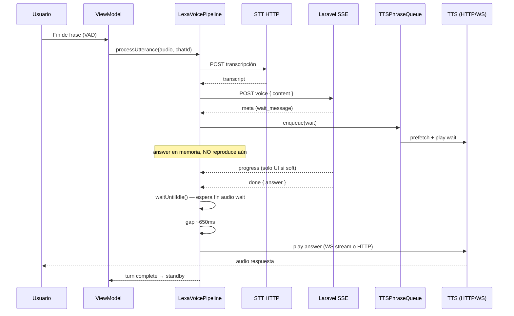

# Arquitectura LEXA — respuestas rápidas (mobile → guía para Angular)

Documento para alinear el **frontend Angular** con la implementación actual de **NotiJudicial-iOS** (iPhone + Apple Watch). Describe *por qué* el flujo se siente rápido y *qué patrones* replicar en TypeScript.

Relacionado: [voice-assistant.md](./voice-assistant.md) (contrato SSE/TTS del modal Angular), [guia-proveedores-voz.md](./guia-proveedores-voz.md) (API keys y perfiles).

---

## 1. Idea central

La percepción de velocidad no viene de “una sola llamada mágica”, sino de **orquestar tres servicios en serie con paralelismo donde importa**:

| Fase | Servicio | Protocolo | Objetivo de latencia |
|------|----------|-----------|----------------------|
| 1. Voz del usuario | STT (DeepInfra / Deepgram / OmniVoice) | HTTP multipart | Transcripción lo antes posible |
| 2. Cerebro + RAG | Laravel | **SSE** `POST …/ai-chats/{chatId}/voice` | Feedback inmediato (`meta`, `progress`) + `answer` al final |
| 3. Voz de Lexa | TTS (Deepgram / OmniVoice) | HTTP o WebSocket | **Primero** mensaje de espera, **después** respuesta completa |

El cliente **no espera** a tener todo el texto para empezar a hablar: en cuanto el backend envía `wait_message`, ya sintetiza y reproduce. La respuesta larga (`answer`) se **bufferiza** hasta que termine ese audio.

---

## 2. Capas en mobile (SOLID / MVVM)

```
┌─────────────────────────────────────────────────────────────┐
│  View (SwiftUI) — orb, estados, waveform de fondo         │
│  VoiceAssistantView / WatchVoiceAssistantView               │
└───────────────────────────┬─────────────────────────────────┘
                            │ gestos, @Published state
┌───────────────────────────▼─────────────────────────────────┐
│  ViewModel — VoiceAssistantViewModel                        │
│  • mic ON/OFF, standby 10s, haptics                         │
│  • NO contiene lógica STT/SSE/TTS                           │
└───────────────────────────┬─────────────────────────────────┘
                            │ processUtterance(callbacks)
┌───────────────────────────▼─────────────────────────────────┐
│  Domain — LexaVoicePipeline                                 │
│  • un “turno”: STT → SSE → cola TTS                         │
│  • reglas wait/answer, prefetch, gaps                       │
└───────┬─────────────────┬─────────────────┬───────────────┘
        │                 │                 │
   SpeechTranscribing  VoiceRAGStreaming  SpeechSynthesizing
   (protocol)          (protocol)         (protocol)
        │                 │                 │
   DeepInfraSTT      AiVoiceChatSSE     Deepgram HTTP/WS
   DeepgramSTT       Service            OmniVoice WS
   OmniVoiceSTT                         TTSPhraseQueue
```

**Equivalente Angular sugerido:**

| Mobile | Angular (referencia actual) |
|--------|-----------------------------|
| `VoiceAssistantViewModel` | `voice-assistant-modal.component.ts` (estado UI + timers) |
| `LexaVoicePipeline` | Servicio `LexaVoicePipelineService` o métodos privados del modal, **extraídos** del componente |
| `SpeechTranscribing` | Adapter `SttProvider` (`deepinfra`, `deepgram`, `omnivoice`) |
| `VoiceRAGStreaming` | `AiVoiceChatService.streamVoice()` |
| `SpeechSynthesizing` + `TTSPhraseQueue` | `TtsQueueService` + proveedor TTS |

Separar pipeline y UI evita que el modal de 800 líneas sea la única fuente de verdad (mismo beneficio que en iOS).

---

## 3. Flujo de un turno (secuencia)



---

## 4. Decisiones que hacen la UX “rápida”

### 4.1 Mensaje de espera antes que la respuesta

Cuando el RAG tarda, Laravel envía `meta.wait_message` (o `progress` con `immediate: true`). El pipeline:

1. Encola **solo una** frase `wait` en `TTSPhraseQueue`.
2. Reproduce ese TTS **mientras** el SSE puede seguir abierto.
3. Guarda `done.answer` en `pendingAnswer` **sin** sintetizarla todavía.

Así el usuario oye enseguida *“Buscando en el expediente…”* en lugar de silencio hasta que el RAG termine.

**Angular:** mantener `waitPlayed` y la misma regla: no iniciar TTS del `answer` hasta que el audio `wait` haya terminado.

### 4.2 No cortar el wait con el answer

Errores comunes que **ralentizan o rompen** la percepción:

- Llamar `stop()` del reproductor entre wait → answer (corta la última sílaba del wait).
- Lanzar el HTTP del `answer` **antes** de que el wait esté en vuelo o terminado (en ngrok, el request largo “roba” ancho al wait corto).

En iOS, `TTSPhraseQueue`:

- **Prefetch** del `answer` solo cuando el `wait` ya está sonando o terminó.
- **No** hace `flushBeforePlay` entre wait → answer.
- Tras el wait, espera `ttsWaitToAnswerGap` (~650 ms) antes del answer.

### 4.3 Cola serial con prefetch (`TTSPhraseQueue`)

```text
pending: [ wait, answer ]
         │      └── prefetch HTTP cuando wait está playing
         └── drain secuencial: synthesize → play → siguiente
```

- Un solo `drainTask` consume la cola.
- `synthesisTasks` guarda `Task` por texto+kind para **pedir el WAV en paralelo** mientras suena el wait.
- Si llega otro `wait`, **reemplaza** el pendiente (no acumula 5 mensajes de espera).

**Angular:** un `BehaviorSubject` o cola async con `prefetchAnswer$` equivalente; evitar N WebSockets simultáneos.

### 4.4 Progress sin voz (`ttsSpeakProgressAudio = false`)

Los eventos `progress` con `immediate: false` solo actualizan texto en UI (`statusOverride`), **no** generan TTS.

Motivo: cada frase extra en TTS suma 1–3 s de síntesis + cola. El usuario ya oyó el wait; el resto es “ruido” hasta el `done`.

```typescript
// Equivalente en environment / constantes
TTS_SPEAK_PROGRESS_AUDIO = false;
```

Si en el futuro quieren voz en progress, limitar a `immediate: true` y solo si `!waitPlayed`.

### 4.5 Un solo TTS por `answer` (no por chunk SSE)

El stream SSE **no** alimenta TTS frase a frase en tiempo real. El `answer` llega completo en `done` y entonces se sintetiza.

Ventaja: texto estable, sin re-sintetizar correcciones parciales.  
Coste: la primera sílaba del answer empieza después del RAG completo (mitigado con wait + prefetch).

**Mejora opcional (iOS ya tiene utilidad):** `TTSSentenceChunker` parte respuestas largas en trozos ~160 caracteres para **varias** peticiones TTS más cortas (primera frase antes). Angular puede adoptar lo mismo si las respuestas superan ~20 s de audio.

### 4.6 STT → SSE estrictamente en orden

No se abre el SSE hasta tener `transcript`. El body es mínimo:

```json
{ "content": "texto transcrito" }
```

El historial lo resuelve Laravel por `chatId` (igual que chat de texto).

### 4.7 Proveedores intercambiables

Perfil activo en desarrollo mobile: **`deepinfra_deepgram`**

| Rol | Proveedor | Endpoint |
|-----|-----------|----------|
| STT | DeepInfra Whisper | `POST https://api.deepinfra.com/v1/audio/transcriptions` |
| TTS wait | Deepgram HTTP | `POST https://api.deepgram.com/v1/speak?...` |
| TTS answer | Deepgram WebSocket (iOS) | `wss://api.deepgram.com/v1/speak?...` + mensajes `Speak` / `Flush` |

Factory en Swift: `VoiceProviderFactory` lee `LEXA_VOICE_PROFILE` del `.xcconfig`.

**Angular:** mismas variables de entorno por perfil; no mezclar OmniVoice local si el mobile ya está en DeepInfra+Deepgram.

### 4.8 Captura + VAD (antes del pipeline)

- Pre-roll ~550 ms para no perder el inicio de la frase.
- VAD con umbrales + (opcional) Silero en iOS; en Watch solo RMS legacy.
- Tras cada turno: **standby** con mic abierto y timeout 10 s sin voz → cierra sesión.

El ViewModel bloquea nuevos utterances mientras `isPipelineRunning`.

---

## 5. Contrato SSE (paridad Angular ↔ iOS)

Parser: `LexaSSEParser` / `AiVoiceChatService` — misma lógica.

| Evento | Campos clave | Acción cliente |
|--------|--------------|----------------|
| `meta` | `wait_message`, `estimated_wait_sec` | Texto UI + TTS wait (una vez) |
| `progress` | `text`, `immediate`, `soft` | Si `immediate && !waitPlayed` → TTS wait; si no, solo UI |
| `done` | `answer`, `conversation_end` | Buffer answer; TTS después del wait |

Regla `waitPlayed`:

```typescript
let waitPlayed = false;

onMeta(meta) {
  if (meta.wait_message && !waitPlayed) {
    waitPlayed = true;
    ttsQueue.enqueue(meta.wait_message, 'wait');
  }
}

onProgress(p) {
  updateStatus(p.text);
  if (p.immediate && !p.soft && !waitPlayed) {
    waitPlayed = true;
    ttsQueue.enqueue(p.text, 'wait');
  }
  // NO tts si TTS_SPEAK_PROGRESS_AUDIO === false
}

onDone(done) {
  pendingAnswer = done.answer;
  conversationEnd = done.conversation_end;
}
```

Cuando el stream SSE cierra:

```typescript
await ttsQueue.waitUntilIdle();  // termina wait
if (pendingAnswer) {
  await sleep(650);              // gap
  await playAnswer(pendingAnswer);
}
```

---

## 6. Estados de UI (máquina de estados)

Mobile: `LexaPresentationState` — solo presentación; el pipeline emite callbacks.

| Estado | Cuándo | Orb / UX |
|--------|--------|----------|
| `idle` | Mic apagado | Toca para activar |
| `standby` | Mic abierto, esperando voz | Escuchando… |
| `listening` | VAD detectó voz | Grabando |
| `transcribing` | STT en curso | Procesando |
| `thinking` | SSE abierto, sin TTS aún | Consultando… |
| `waiting` | TTS del wait sonando | Ámbar / “Un momento…” |
| `preparingAnswer` | Wait terminó, sintetizando answer | Preparando… |
| `speaking` | TTS answer | Lexa habla |
| `error` | Fallo red/auth | Mensaje + reintentar |

**Angular:** un `enum VoiceUiState` + `statusOverride` para textos del SSE (`wait_message`, progress) sin mezclar con el título fijo del estado.

---

## 7. TTS: wait vs answer (implementación)

### Wait (frase corta)

- **Deepgram HTTP:** un POST, respuesta WAV `linear16`, un buffer, play.
- OmniVoice (perfil legacy): WebSocket, acumular PCM hasta `done` JSON (ver voice-assistant.md §7).

### Answer (puede ser largo)

**iOS (Deepgram):** `DeepgramStreamingTTSService`

1. `wss://api.deepgram.com/v1/speak?model=…&encoding=linear16`
2. Enviar JSON `{ "type": "Speak", "text": "…" }` por frases.
3. `{ "type": "Flush" }` → recibir chunks binarios PCM.
4. `StreamingPCMPlayer` reproduce chunks **sin** crear un `AudioBuffer` por chunk (evita “pa-pa-pa”).
5. Fallback a HTTP + `TTSPhraseQueue` si el WS falla.

**Angular con OmniVoice:** acumular PCM y un solo `AudioBuffer` por frase (ya documentado).  
**Angular con Deepgram:** replicar WS Aura o HTTP por frases con `TTSSentenceChunker`.

### Normalización de audio

`AudioPlaybackPolish` sube pico/RMS del WAV antes de reproducir; en Watch además `PlaybackVolumeControl` (corona → mixer).

---

## 8. Esqueleto TypeScript sugerido

```typescript
@Injectable({ providedIn: 'root' })
export class LexaVoicePipelineService {
  constructor(
    private stt: SttProviderFactory,
    private rag: AiVoiceChatService,
    private tts: TtsProviderFactory,
    private queue: TtsPhraseQueueService,
  ) {}

  async processUtterance(
    audio: Blob,
    chatId: string,
    hooks: VoiceTurnHooks,
  ): Promise<VoiceTurnResult> {
    const transcript = await this.stt.transcribe(audio);
    hooks.onTranscript(transcript);
    if (!transcript.trim()) return { transcript, shouldEnd: false };

    let waitPlayed = false;
    let pendingAnswer: string | undefined;
    let shouldEnd = false;

    for await (const event of this.rag.streamVoice(chatId, transcript)) {
      if (event.meta?.wait_message && !waitPlayed) {
        waitPlayed = true;
        hooks.onWaitScheduled();
        this.queue.enqueue(event.meta.wait_message, 'wait');
      }
      if (event.progress) {
        hooks.onStatus(event.progress.text);
        if (event.progress.immediate && !event.progress.soft && !waitPlayed) {
          waitPlayed = true;
          this.queue.enqueue(event.progress.text, 'wait');
        }
      }
      if (event.done) {
        pendingAnswer = event.done.answer;
        shouldEnd = event.done.conversation_end;
      }
    }

    await this.queue.waitUntilIdle();
    if (pendingAnswer?.trim()) {
      await delay(650);
      await this.playAnswer(pendingAnswer, hooks);
    }
    return { transcript, shouldEnd };
  }
}
```

---

## 9. Checklist para el equipo Angular

- [ ] **Mismo perfil de voz** que mobile (`deepinfra_deepgram` o documentar desvío).
- [ ] **Pipeline extraído** del componente del modal (testeable).
- [ ] **wait → idle queue → answer** con prefetch del answer durante el wait.
- [ ] **`TTS_SPEAK_PROGRESS_AUDIO = false`** salvo producto explícito.
- [ ] **No** TTS por cada línea SSE; solo `wait` + `done.answer`.
- [ ] **Gap** ~650 ms entre wait y answer.
- [ ] **Un buffer / stream coherente** por frase TTS (no reproducir chunks sueltos).
- [ ] **`chatId`** = UUID de `ai_chats.id`, no tenant RAG.
- [ ] Tras el turno: refrescar historial con `user_message_id` / `assistant_message_id` del `done`.
- [ ] `conversation_end === true` → cerrar modal tras TTS del answer.

---

## 10. Archivos de referencia en el repo iOS

| Archivo | Contenido |
|---------|-----------|
| `Features/VoiceAssistant/Domain/LexaVoicePipeline.swift` | Orquestación wait/answer |
| `Features/VoiceAssistant/Services/TTSPhraseQueue.swift` | Cola + prefetch |
| `Features/VoiceAssistant/Services/AiVoiceChatSSEService.swift` | Cliente SSE Laravel |
| `Features/VoiceAssistant/Model/LexaSSEEvent.swift` | Parser meta/progress/done |
| `Features/VoiceAssistant/ViewModel/VoiceAssistantViewModel.swift` | Estados UI + mic |
| `Features/VoiceAssistant/Services/TTSSentenceChunker.swift` | Trocear respuestas largas |
| `Features/VoiceAssistant/Services/TTS/DeepgramStreamingTTSService.swift` | TTS answer por WebSocket |
| `Core/Config/AppConfig.swift` | Flags (`ttsSpeakProgressAudio`, gaps, VAD) |
| `Configuration/Development.xcconfig` | Perfil y keys de desarrollo |

---

## 11. Resumen en una frase

**Primero haz oír al usuario (wait TTS en cuanto el backend lo dice), bufferiza la respuesta final, prefetch mientras suena el wait, y solo entonces sintetiza y reproduce el `answer` — con progress en pantalla pero sin más colas de voz.**

Eso es lo que hace mobile hoy y es el patrón que Angular debería conservar (o refactorizar hacia él) para la misma sensación de respuesta rápida.
