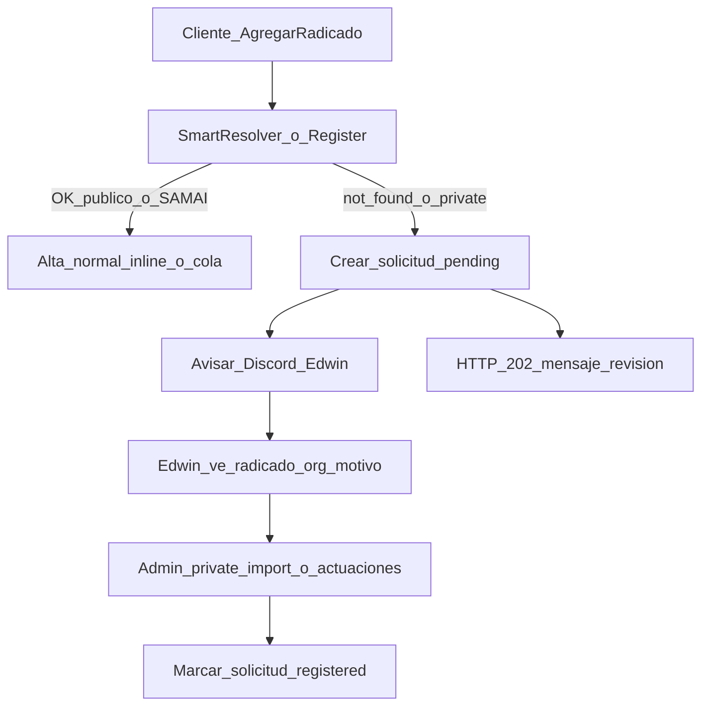

# Handoff: solicitud a Edwin cuando el abogado no puede agregar radicado

Documento para pasar a otro chat / frontend. **Estado backend MVP: implementado.**

---

## Estado de implementación (backend)

Implementado:

- Tabla `manual_registration_requests` + modelo/enums (+ `process_class`, `plaintiffs`, `defendants`, `other_subjects`).
- `POST /processes` si no elegible → **202** `manual_registration_required` (**sin** crear solicitud / Discord).
- `POST /processes/manual-registration-requests` con sujetos + clase + rol → crea `pending` + Discord + admin WS.
- Cuenta `unassigned_process_actions` en la solicitud y lo muestra en Discord.
- Idempotencia Discord: mismo org+radicado `pending` no reenvía.
- Jobs async (`SyncJudicialBranchJob` / `SyncSamaiJob`) siguen pudiendo crear solicitud en fallo definitivo (sin modal).
- Env: `DISCORD_ALERT_WEBHOOK_MANUAL_REGISTRATION` (canal Discord `#crear-procesos-privados`).

Pendiente (fuera de este MVP):

- Heurística edicto-only.

Asociación de histórico: al crear el `Process` (p. ej. `private-import`), `Process::created` → `AttachUnassignedProcessActionsService` ya asocia `unassigned_process_actions`.

Al completar alta (`PATCH … status=registered` **o** `private-import` del mismo org+radicado): se marca `registered`, se envía **mail** (layout emails existente) + **database + WebSocket** al abogado solicitante y a los `appUsers` de la org.

### UI app_user (backend listo)

- Stats: `pending_manual_registrations` en `GET /api/app-user/dashboard/stats`.
- Modal lista: `GET /api/app-user/processes/manual-registration-requests`.
- Listado/detalle: `is_manual_sync` (true = subido manualmente / Excel privado).

### UI admin (backend listo)

- Menú sugerido: **Altas manuales** / **Pendientes digitación** (badge con count).
- Stats: `pending_manual_registrations` en `GET /api/admin/dashboard/stats`.
- Cola paginada: `GET /api/admin/processes/manual-registration-requests`.
- Resolver: `PATCH /api/admin/processes/manual-registration-requests/{id}` con `{ "status": "registered" | "rejected" }`.
- Al marcar **registered** (o al completar `private-import` del mismo radicado+org): mail al abogado/org + notificación interna WebSocket (`ManualRegistrationCompleted` / `manual-registration-completed`).
- Listado procesos admin ya expone `is_manual_sync` + `data_source_*` (columna Origen / badge Manual).
- **WebSocket + campanita admin:** al crear solicitud nueva se notifica a todos los `User` admin activos (`database` + `broadcast`), tipo `ManualRegistrationRequested` / `data.type = manual-registration-requested`, canal privado `Src.Domain.User.Models.User.{id}` (mismo patrón que otras notificaciones admin). Queue: `notifications`.

---

## Contrato API para frontend (`POST /api/app-user/processes`)

### Éxito (sin cambios)

- **201** — proceso registrado, o
- **201** — `{ "message": "…en segundo plano…" }` si fue a cola.

### Nuevo: no elegible → modal de datos (sin crear solicitud aún)

- **202 Accepted** cuando no se puede alta automática (`not_found` / `private` / `all_private`)

```json
{
  "message": "Este radicado no está disponible en consulta automática. Completa la información del proceso para enviarlo a revisión con tu asesor.",
  "status": "manual_registration_required",
  "reason": "private",
  "reason_label": "Proceso privado",
  "process_number": "76892400300120260066300",
  "lawyer_role": "defendant",
  "unassigned_actions_count": 0,
  "requires_details": true
}
```

| Campo | Uso FE |
|-------|--------|
| `status` | `"manual_registration_required"` → abrir modal (no toast de éxito) |
| `reason` / `reason_label` | Explicar por qué no es elegible |
| `process_number` | Prefill (readonly) |
| `lawyer_role` | Prefill del paso anterior; editable en modal |
| `requires_details` | Siempre `true` en este path |
| `request_id` | **No viene** — aún no hay solicitud |

**Importante:** este 202 **no** crea fila en BD ni Discord. Eso ocurre solo al guardar el modal.

### Confirmar con datos del modal

`POST /api/app-user/processes/manual-registration-requests`

```json
{
  "process_number": "76892400300120260066300",
  "reason": "private",
  "lawyer_role": "defendant",
  "process_class": "Verbal",
  "plaintiffs": [{ "name": "Juan Pérez", "identification": "123" }],
  "defendants": [{ "name": "Empresa SA" }],
  "other_subjects": [{ "name": "Apoderado X" }]
}
```

Respuesta **202**:

```json
{
  "message": "Recibimos tu solicitud. Lo dejamos en revisión con tu asesor; te confirmaremos cuando quede registrado.",
  "status": "manual_review",
  "reason": "private",
  "reason_label": "Proceso privado",
  "request_id": "uuid",
  "unassigned_actions_count": 0,
  "data": { "...ManualRegistrationRequestResource" }
}
```

Validación: `plaintiffs` y `defendants` mín. 1 ítem con `name`; `other_subjects` opcional; `process_class` y `lawyer_role` requeridos.

### Qué ya no debe asumir el frontend

- Antes: **202** `manual_review` + `request_id` al primer `POST /processes` (solicitud ya creada).
- Ahora: primer `POST /processes` → `manual_registration_required` + modal; segundo `POST …/manual-registration-requests` → `manual_review` + `request_id` + Discord.

Siguen igual:

- **401** no auth
- **422** validación (`process_number`, `lawyer_role`) o `already_registered` / sin organización

### UX sugerida

1. Si `status === 'manual_registration_required'`: abrir modal (no error rojo).
2. Mostrar `reason_label` + `message`.
3. Formulario: demandantes, demandados, otros sujetos, clase de proceso, rol (Demandante/Demandado).
4. Guardar → `POST …/manual-registration-requests` con `reason` del 202 anterior.
5. Éxito → toast con `message` del segundo response; refrescar contador `pending_manual_registrations`.

---

## Contrato UI Gestión de Procesos (app_user)

### Contador + modal (en espera del asesor)

**Count (ya en stats de la pantalla):**  
`GET /api/app-user/dashboard/stats` → campo nuevo:

```json
{
  "pending_manual_registrations": 3
}
```

Mostrar card/chip tipo **“EN REVISIÓN CON ASESOR”** / **“Pendientes de registro”** con ese número. Al click → abrir modal y llamar:

**Lista modal:**  
`GET /api/app-user/processes/manual-registration-requests`

```json
{
  "count": 1,
  "data": [
    {
      "id": "uuid",
      "process_number": "76892400300120260066300",
      "reason": "not_found",
      "reason_label": "No encontrado en consulta automática",
      "status": "pending",
      "lawyer_role": "plaintiff",
      "unassigned_actions_count": 2,
      "requested_by_name": "Carlos Ruiz",
      "requested_by_identification": "111222333",
      "created_at": "…"
    }
  ]
}
```

Columnas sugeridas modal: radicado, motivo (`reason_label`), solicitado por, fecha, hint si `unassigned_actions_count > 0`.

Estos ítems **no** son procesos registrados aún (no hay `process.id` para navegar al detalle).

### Atributo “subido manualmente”

En `GET /api/app-user/processes` (cada fila e `instances[]`) y `GET /api/app-user/processes/{id}` → `process`:

| Campo | Tipo | UI |
|-------|------|-----|
| `is_manual_sync` | `bool` | Badge **“Manual”** / **“Subido manualmente”** cuando `true` |

Es el mismo flag que usa admin (`is_manual_sync`): procesos cargados por Excel privado / fuera del sync automático Rama/SAMAI.

### Notificación al abogado cuando el asesor completa el alta

Disparadores backend:

1. Admin marca `PATCH …/manual-registration-requests/{id}` con `status: registered`.
2. Admin completa `private-import` del mismo `organization_id` + radicado(s) pendientes → auto-`registered`.

Canales al solicitante **y** a los `appUsers` de la organización:

| Canal | Detalle |
|-------|---------|
| Email | Layout `emails.layouts.email`, asunto tipo “Tu radicado :number ya está registrado”, CTA a `/gestion-procesos/{id}` |
| Database + WebSocket | Mismo patrón Echo que otras notificaciones app_user |

**Echo / campanita (app_user):**

- Canal privado: `Src.Domain.AppUser.Models.AppUser.{id}`
- Event type: `ManualRegistrationCompleted`
- `data.type`: `manual-registration-completed`
- Payload útil: `title`, `description`, `request_id`, `process_id`, `process_number`, `url` (`/gestion-procesos/{id}` o `/gestion-procesos` si aún no hay process)

Queues: `notifications-email` (mail), `notifications` (database/broadcast).

UX: toast/campanita → navegar a `url`; refrescar contador `pending_manual_registrations` (baja al resolverse).

---

## Contrato UI Admin — cola para Edwin

### Menú lateral

Nueva opción (junto a Procesos / Historial importaciones), por ejemplo:

- Label: **Altas manuales** o **Pendientes de digitación**
- Ruta FE sugerida: `/admin/manual-registrations` (o similar)
- Badge: usar `pending_manual_registrations` de `GET /api/admin/dashboard/stats`

### Listado (página del menú)

`GET /api/admin/processes/manual-registration-requests`

Query params:

| Param | Default | Valores |
|-------|---------|---------|
| `status` | `pending` | `pending` \| `registered` \| `rejected` |
| `reason` | — | `not_found` \| `private` \| `all_private` |
| `organization` | — | LIKE nombre org |
| `process_number` | — | parcial dígitos |
| `per_page` | `20` | 1–100 |

Respuesta: paginator Laravel estándar (`data`, `total`, `current_page`, …).

Cada ítem:

```json
{
  "id": "uuid",
  "process_number": "76892400300120260066300",
  "reason": "not_found",
  "reason_label": "No encontrado en consulta automática",
  "status": "pending",
  "lawyer_role": "plaintiff",
  "unassigned_actions_count": 2,
  "discord_notified": true,
  "organization_id": "uuid",
  "organization_name": "Org Alpha",
  "app_user_id": "uuid",
  "requested_by_name": "Ana Lopez",
  "requested_by_identification": "99887766",
  "requested_by_email": "ana.lopez@example.com",
  "created_at": "…",
  "resolved_at": null
}
```

UX sugerida: columnas radicado, organización, solicitante, motivo, histórico pendiente (`unassigned_actions_count`), fecha. CTA: **Importar privado** (flujo Excel existente) y luego **Marcar registrado**.

### Resolver solicitud

`PATCH /api/admin/processes/manual-registration-requests/{id}`

```json
{ "status": "registered" }
```

o `"rejected"`. Solo desde `pending`.

### Listado/detalle procesos admin (ya existía parcialmente)

En `GET /api/admin/processes` ya viene `is_manual_sync` (+ `data_source_slug` / `data_source_name`). Mostrar badge **Manual** cuando `is_manual_sync === true` (además del Origen JUDICIAL/SAMAI).

---

## 1. Problema de negocio (voz de Edwin)

Cuando un cliente/abogado intenta **Agregar radicado** y el proceso:

- no está disponible para consulta en línea (Rama Judicial),
- es **privado**, o
- solo existe vía **publicaciones procesales** (municipios: Bolívar, Cauca, Quindío, etc.),

el sistema hoy **falla** y el mensaje dice contactar al asesor. Eso genera WhatsApp a Edwin.

Edwin necesita:

1. **Enterarse solo** (sin depender del cliente).
2. Saber **juzgado/despacho** para su listado de digitación.
3. Poder dar de alta después con las herramientas admin que ya tiene (Excel privado / actuaciones).

Urgencia operativa mencionada: con **términos suspendidos** y reactivación el lunes, muchos clientes van a querer agregar demandas nuevas que aún no están en consulta en línea → traumatismo si no hay esta funcionalidad.

Caso ejemplo citado: radicado `76892400300120260066300` (Yumbo) — Edwin aclaró: **no es SAMAI**, es **publicaciones procesales / privado**.

---

## 2. Qué NO es este flujo

- No es el sync diario ni consolidados.
- No es el Discord de `log_sync_daily` / `late_sync` (ya existen para sync).
- No es el “edicto emplazatorio only” (fase 2): Rama encuentra el radicado pero solo hay edicto; actuaciones reales van por publicaciones. Ese caso **sigue entrando por path judicial normal** si no se define heurística aparte.
- No reemplaza el Excel de privados de admin; lo **alimenta con leads**.

---

## 3. Comportamiento actual (código)

### Entrada app_user

- `POST /api/app-user/processes`
- Controller: `src/Application/AppUser/Process/Controllers/ProcessController.php` → `store()`
- Resuelve con `SmartProcessRegistrationResolverService`
- Luego inline `RegisterProcessService` / `RegisterSamaiProcessService` o dispatch a cola `process-import`.

### Orden del resolver

1. ¿Ya registrado en la org? → `422 already_registered`
2. ¿Existe en BD? → fast-path (attach)
3. Si sync JB activo → defer cola (sin sondear Portal); SAMAI-eligible puede intentar SAMAI
4. Intentar Rama Judicial (público)
5. Si miss / todos privados → SAMAI solo si `ProcessConsultationScopeHelper::shouldConsultSamai`
6. Si no → **`abort(404, process.not_found_in_any_source)`**

### Fallos relevantes (lang ES)

En `resources/lang/es/process.php`:

| Key | Mensaje actual |
|-----|----------------|
| `not_found_in_any_source` | no se encuentra habilitado; contacte a su asesor |
| `not_found_in_judicial_branch` | no disponible para consulta en línea |
| `is_private` | proceso privado; no es posible registrarlo |
| `all_instances_are_private` | todas las instancias privadas |

En esos aborts **hoy**:

- no se crea ticket/solicitud,
- no hay Discord,
- no hay fila “pending manual” visible para Edwin,
- `ProcessRegistrationLog` solo existe en path **async** (`pending|success|failed`), no en el 404/422 síncrono.

### Cómo Edwin da de alta hoy (sí existe)

Admin Excel (sin Discord de solicitud):

| Endpoint | Uso |
|----------|-----|
| `POST /api/admin/processes/import` | Alta desde Portal/SAMAI |
| `POST /api/admin/processes/private-import` | Privados / publicaciones (crea manual + actuaciones) |
| `POST /api/admin/processes/actuaciones-import` | Actualizar actuaciones de procesos existentes |

Rutas: `routes/api/admin/processes.php`.

---

## 4. Flujo propuesto (acordado en chat)



### Cliente

- Dejar de devolver solo 404 seco.
- Respuesta tipo **202**: “Este radicado no está disponible en consulta automática. Lo dejamos en revisión con tu asesor.”
- Opcional UI: estado “En revisión” (no inventar proceso activo sin datos).

### Solicitud / cola interna

Crear registro (tabla nueva recomendada, o extender logs), campos mínimos:

- `process_number` (radicado)
- `organization_id`, `app_user_id`
- `reason`: `not_found` | `private` | `all_private` (y más adelante `edict_only`)
- `status`: `pending` → `registered` | `rejected`
- timestamps
- opcional: `court_hint`, notas, quién resolvió

Admin: listado “Pendientes de digitación / publicaciones procesales”.

### Discord a Edwin

Al crear la solicitud, enviar embed/mensaje con:

- radicado
- usuario (nombre, cédula, email)
- organización
- motivo (`not_found` / `private` / …)
- timestamp

Reutilizar patrón existente:

- `src/Application/Shared/Services/Notification/Channels/DiscordNotificationChannelService.php`
- Config: `config/discord-alerts.php` — keys `default`, `log_sync_daily`, `late_sync`, **`manual_registration`**
- Env: `DISCORD_ALERT_WEBHOOK_MANUAL_REGISTRATION`
- Canal Discord: `#crear-procesos-privados`

Referencia de estilo embeds: `JudicialSyncDiscordNotificationService`.

Email admin (alternativa/complemento): ya existe patrón `ProcessBecamePrivateMailable` / `process-import.admin_report_email` — se puede reutilizar destinatario, pero el pedido explícito reciente es **Discord**.

---

## 5. Puntos de enganche técnicos sugeridos

1. **Resolver / store** cuando hoy hace `abort(404 not_found_in_any_source)` — capturar y convertir a “crear solicitud + Discord + 202”.
2. **`RegisterProcessService`** cuando aborta `is_private` / `all_instances_are_private` (422) — mismo tratamiento si el abogado no puede completar alta.
3. Jobs async (`SyncJudicialBranchJob` / `SyncSamaiJob`): si fallan por not found / private definitivo, también crear solicitud (hoy solo notifican al app_user con `ProcessImportFailedNotification`).
4. **No** crear solicitud en: `already_registered`, errores transitorios de API (proxy/403) que se reintentan.

Idempotencia: no spamear Discord si el mismo org+radicado ya tiene `pending` reciente.

---

## 6. MVP recomendado (prioridad)

**Fase 1 (urgente):**

- Interceptar fallos `not_found` / `private` en alta app_user.
- Persistir solicitud `pending`.
- Discord a Edwin.
- Respuesta amable al cliente (202).
- Sin UI admin completa (Edwin puede usar Discord + Excel privado).

**Fase 2:**

- Pantalla admin de pendientes + marcar resuelto.
- Heurística edicto-only (Rama encuentra pero historial inútil).

**Fase 3:**

- Estado “En revisión” en frontend lista del abogado.

---

## 7. Relación con privados / publicaciones

Edwin (audios): en algunos municipios el proceso aparece en Rama **solo para edicto emplazatorio**; actuaciones van por publicaciones procesales. Le preocupa falsos positivos judiciales y no enterarse del juzgado.

Por eso la cola no es solo “404”: también privacidad / no consultable, y más adelante edicto-only.

Alta manual posterior: **`private-import`** + luego **`actuaciones-import`**.

---

## 8. Mensajes / producto (borrador)

**Cliente:**  
“Este radicado no está disponible en consulta automática. Lo dejamos en revisión con tu asesor; te confirmaremos cuando quede registrado.”

**Discord (ejemplo):**  
“Solicitud de alta manual — radicado `…` — org X — usuario Y (cédula) — motivo: privado/no encontrado — rol abogado: …”

**A Edwin (contexto):**  
La digitación Excel ya existe; falta el eslabón: aviso automático + cola cuando el cliente no puede agregar.

---

## 9. Archivos clave

| Área | Path |
|------|------|
| Alta app_user | `src/Application/AppUser/Process/Controllers/ProcessController.php` (`store`) |
| Routing fuentes | `src/Application/AppUser/Process/Services/SmartProcessRegistrationResolverService.php` |
| Scope SAMAI | `src/Application/Shared/Helpers/ProcessConsultationScopeHelper.php` |
| Registro JB | `src/Application/AppUser/Process/Services/RegisterProcessService.php` |
| Registro SAMAI | `src/Application/AppUser/Process/Services/RegisterSamaiProcessService.php` |
| Dispatch async | `DispatchProcessRegistrationService` / `DispatchSamaiProcessRegistrationService` (cola `process-import`) |
| Log async actual | `ProcessRegistrationLog` |
| Import privado admin | `src/Application/Admin/Process/Services/PrivateProcessExcelImportService.php` |
| Discord base | `DiscordNotificationChannelService` + `config/discord-alerts.php` |
| Lang | `resources/lang/es/process.php` |

---

## 10. Decisiones ya tomadas en conversación

- Objetivo: **solicitud + aviso Edwin + mensaje cliente**, no solo Discord suelto sin persistir.
- Canal preferido de aviso: **Discord** (además o en lugar de WhatsApp del cliente).
- Admin Excel privado **ya sirve** para completar el alta.
- Caso edicto-only = **fase 2**.
- MVP técnico sugerido: tabla `manual_registration_requests` (o similar) + notify Discord + 202.

---

## 11. Fuera de alcance de este handoff (otros temas del mismo hilo)

- Puerta `process-import` para app_user durante sync (ya implementado en otro tramo).
- Semáforo unificado instancias/header (hotfix).
- Normalización despacho Tribunal SAMAI `000` = magistrado (fix helper + 2 radicados).
- Exports SQL clientes / SAMAI.
- Fixes puntuales prod (fecha 2070, consolidado histórico Rodrigo).

Esos no son este flujo; no mezclar en la implementación de solicitudes.

---

## 12. Criterios de aceptación (para el chat que implemente)

1. Abogado agrega radicado no consultable/privado → no queda solo en 404/422 silencioso para ops.
2. Queda registro `pending` consultable.
3. Discord llega con radicado + org + usuario + motivo.
4. Cliente recibe mensaje de “en revisión”, no “contacte a su asesor” genérico (o texto acordado).
5. Mismo radicado+org no dispara N alertas Discord en ráfaga.
6. Edwin puede completar con `private-import` y marcar/resolver la solicitud.
7. Tests del path de fallo de registro + (ideal) fake Discord.

---

## 13. Prompt corto para pegar al otro chat

> Implementar flujo: cuando `POST /api/app-user/processes` no puede alta por not_found/private, crear solicitud pending para ops (Edwin), notificar Discord (nuevo webhook en discord-alerts), devolver 202 amable al cliente. Reusar DiscordNotificationChannelService. Admin ya tiene private-import. No implementar aún heurística edicto-only. Ver handoff completo en `docs/handoff-solicitud-alta-manual-edwin.md`.
