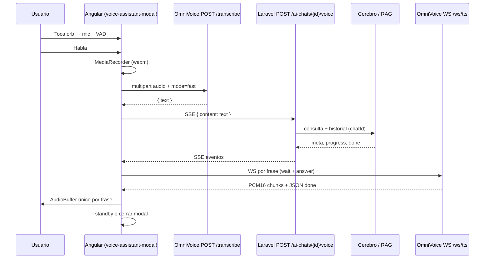

# Asistente de voz Lexa — Documentación de implementación (frontend Angular)

Documento de referencia con lo implementado en **judicial-filings-frontend**: flujo completo, endpoints, WebSockets, formatos de respuesta, procesamiento de audio, decisiones tomadas y guía para una app **iOS (Swift)**.

---

## 1. Resumen del flujo



| Paso | Responsable | Protocolo |
|------|-------------|-----------|
| Captura + VAD | Frontend | Web Audio API + `MediaRecorder` |
| STT | OmniVoice (RunPod) | **HTTP** `POST /transcribe` |
| Chat + RAG + historial | Laravel | **HTTP SSE** `POST /ai-chats/{chatId}/voice` |
| TTS | OmniVoice (RunPod) | **WebSocket** `wss://.../ws/tts` |

**No** se usa WebSocket para STT en producción (se probó y se revirtió a HTTP). Ver también `docs/ws-transcribe.md` para el WS alternativo de transcripción.

---

## 2. Archivos principales del frontend

| Archivo | Rol |
|---------|-----|
| `src/app/modules/admin/gestion-procesos/components/voice-assistant-modal/voice-assistant-modal.component.ts` | VAD, STT, cola TTS, reproducción PCM, SSE handlers |
| `src/app/modules/admin/gestion-procesos/components/voice-assistant-modal/voice-assistant-modal.component.html` | UI modal (orb, estados, waveform) |
| `src/app/core/services/ai-voice-chat/ai-voice-chat.service.ts` | Cliente SSE `POST .../voice` |
| `src/app/core/config/environment.config.ts` | URLs OmniVoice + `ttsVoiceId` |
| `src/app/core/utils/omnivoice-url.util.ts` | Resolución de URLs relativas |
| `src/app/modules/admin/gestion-procesos/components/process-ai-chat/process-ai-chat.component.ts` | Abre modal, `chatId`, refresco historial |
| `docs/ws-transcribe.md` | STT HTTP (detalle servidor OmniVoice) |

---

## 3. Variables de entorno

```env
NG_APP_API_BASE_URL=https://.../api/admin
NG_APP_OMNIVOICE_TRANSCRIBE_URL=https://.../transcribe
NG_APP_OMNIVOICE_TTS_WS_URL=wss://.../ws/tts
NG_APP_OMNIVOICE_TTS_VOICE_ID=e70acddc
```

Desarrollo local típico:

- Frontend: `pnpm start` → **http://localhost:3901** (`angular.json` → `serve.options.port: 3901`)
- OmniVoice local: `http://127.0.0.1:3900/transcribe` y `ws://127.0.0.1:3900/ws/tts`

---

## 4. STT — `POST /transcribe` (OmniVoice)

### Request

- **Método:** `POST`
- **Content-Type:** `multipart/form-data`
- **Campos:**

| Campo | Obligatorio | Valor en Lexa |
|-------|-------------|---------------|
| `audio` | Sí | Blob `audio/webm` (`utterance.webm`) |
| `mode` | No | `fast` (recomendado) |

### Response (éxito 200)

```json
{
  "text": "Quiero un resumen muy corto de los hechos.",
  "segments": [
    { "start": 0.0, "end": 2.1, "text": "Quiero un resumen muy corto de los hechos." }
  ],
  "language": "es",
  "duration_s": 2.1,
  "transcription_time_s": 0.9,
  "engine": "mlx-whisper"
}
```

| Campo | Uso en frontend |
|-------|-----------------|
| **`text`** | Se envía a Laravel en `POST /voice` como `content` |
| `segments` | No usado actualmente |
| `language` | No usado |
| `duration_s` | No usado |
| `transcription_time_s` | No usado (métricas futuras) |

Si `text` está vacío → se vuelve a **standby** sin llamar al backend.

### Implementación en Angular

```typescript
const formData = new FormData();
formData.append('audio', audioBlob, 'utterance.webm');
formData.append('mode', 'fast');
await fetch(transcribeUrl, { method: 'POST', body: formData });
```

---

## 5. Chat de voz — `POST /ai-chats/{chatId}/voice` (Laravel SSE)

### Request

- **Método:** `POST`
- **Headers:** `Authorization: Bearer {token}`, `Accept: text/event-stream`, `Content-Type: application/json`
- **Body:**

```json
{ "content": "texto transcrito del usuario" }
```

El **historial** no va en el body; Laravel lo resuelve por `chatId` (igual que el chat de texto).

### Formato SSE

Líneas `data: {json}\n\n`. El servicio `AiVoiceChatService` parsea y despacha:

| Orden típico | Contenido JSON | Acción frontend |
|--------------|----------------|-----------------|
| 1 | `{ "meta": { ... } }` | TTS de `wait_message` si existe |
| 2 | `{ "progress": "...", "immediate": true, "source": "voice" }` | TTS solo si no sonó wait (`waitPlayed`) |
| 3 | `{ "progress": "...", "source": "voice" }` | Solo texto en UI (TTS desactivado) |
| 4 | `{ "done": true, "source": "voice", "answer": "...", ... }` | TTS de `answer`; opcional cierre |

### Evento `meta`

```json
{
  "meta": {
    "source": "voice",
    "complexity": "medium",
    "mode_used": "local",
    "wait_message": "Buscando la información, espera un momento...",
    "estimated_wait_sec": 12
  }
}
```

- `wait_message` → cola TTS + texto en modal (`~12s` si hay `estimated_wait_sec`).
- En tier **quick** el backend puede enviar `meta` mínimo o sin wait.

### Evento `progress`

```json
{
  "progress": "Sigo buscando en el expediente...",
  "immediate": false,
  "source": "voice"
}
```

- `immediate: true` → mismo texto que wait a veces; se **omite** TTS si ya sonó `wait_message`.
- Por defecto **`TTS_SPEAK_PROGRESS_AUDIO = false`**: progress solo actualiza `statusText`, no sintetiza voz (menos cola y más rápido hacia la respuesta).

### Evento `done` (final)

```json
{
  "done": true,
  "source": "voice",
  "complexity": "quick",
  "mode_used": "naive",
  "answer": "El Juzgado...",
  "user_message_id": "uuid",
  "assistant_message_id": "uuid",
  "conversation_end": false
}
```

| Campo | Uso |
|-------|-----|
| **`answer`** | Texto limpio para **un** TTS (no se hace TTS por chunks SSE) |
| `user_message_id` / `assistant_message_id` | `turnCompleted` → refrescar historial en `process-ai-chat` |
| **`conversation_end`** | Si `true`: tras TTS de `answer` → cerrar modal (despedida) |
| `complexity` / `mode_used` | Solo logs / UI futura |

### Tipos TypeScript

Definidos en `src/app/core/services/ai-voice-chat/ai-voice-chat.service.ts` (`VoiceSseMeta`, `VoiceSseEvent`).

---

## 6. TTS — WebSocket `wss://.../ws/tts` (OmniVoice)

### Conexión y envío (cliente → servidor)

Al abrir el WS, se envía un JSON:

```json
{
  "text": "Buscando la información, espera un momento...",
  "voice": "e70acddc",
  "language": "Spanish",
  "emo_alpha": 1.0
}
```

`voice` = `NG_APP_OMNIVOICE_TTS_VOICE_ID`.

### Respuesta (servidor → cliente)

Mezcla de **mensajes JSON (string)** y **frames binarios PCM16**.

#### JSON `start`

```json
{ "type": "start", "sample_rate": 24000 }
```

Se fija `ttsSampleRate` (por defecto 24 kHz, alineado con `AudioContext`).

#### Binario

- Tipo: `ArrayBuffer`
- Formato: **PCM16**, mono, little-endian
- Tamaño típico por frame: **9600 bytes** (~200 ms a 24 kHz)

#### JSON `done`

```json
{ "type": "done", "duration_s": 2.8 }
```

- Marca fin de síntesis; **pueden llegar más bytes PCM después** del JSON (comportamiento RunPod).
- El frontend **no** reproduce hasta acumular y validar buffer (ver §7).

#### JSON `error`

```json
{ "type": "error", "detail": "..." }
```

---

## 7. Procesamiento de audio (TTS) en el frontend

### Principio: un buffer por frase (sin streaming por chunk)

Reproducir cada chunk WS como un `AudioBufferSourceNode` separado produce artefactos (**“pa, pa, pa”** / golpes). La solución estable:

1. Acumular todos los `ArrayBuffer` PCM de la sesión WS.
2. Al recibir JSON `done`, esperar **~160 ms** (y hasta 4 reintentos si el buffer sigue creciendo o falta vs `duration_s`).
3. Concatenar PCM16 → `Float32Array` → **un solo** `AudioBuffer`.
4. Fade-in suave al inicio (~64 muestras); **sin fade-out** al final (evita comer la última sílaba en frases cortas).
5. Reproducir con `AudioBufferSourceNode` en timeline `ttsNextPlayTime`.
6. Cerrar el WS desde el **cliente** si el servidor no lo cierra (RunPod suele dejarlo abierto).

### Cola TTS secuencial

```
wait_message (TTS) → [progress solo UI] → answer (TTS)
```

- Una sesión WS activa a la vez (`ttsBusy`).
- Pausa **~350 ms** entre frases de la cola (`TTS_PHRASE_GAP_SEC`).
- Tras terminar audio: **~300 ms** antes de abrir la siguiente sesión WS.

### AudioContext

- Creado en **gesto de usuario** (tap en orb) → `sampleRate: 24000`.
- Compartido: VAD (`AnalyserNode`) + reproducción TTS (`GainNode` → destination).

### Constantes relevantes (componente)

| Constante | Valor | Propósito |
|-----------|-------|-----------|
| `TTS_TAIL_FLUSH_MS` | 160 | Debounce tras JSON `done` |
| `TTS_TAIL_MAX_ATTEMPTS` | 4 | Reintentos si buffer incompleto |
| `TTS_DURATION_FILL_RATIO` | 0.97 | Comparar muestras vs `duration_s` |
| `TTS_SPEAK_PROGRESS_AUDIO` | false | No TTS en progress |
| `STANDBY_SILENCE_MS` | 10_000 | Cerrar modal si 10 s sin hablar en standby |

---

## 8. VAD y captura de micrófono

### Activación

1. Usuario toca el **orb** → `getUserMedia({ audio: true })` (mejora pendiente: `noiseSuppression`, `echoCancellation`).
2. `MediaRecorder` con `audio/webm;codecs=opus` si está soportado.
3. Loop VAD con **RMS** sobre `AnalyserNode` (`VAD_THRESHOLD = 0.012`).

### Estados UI

| Estado | Descripción |
|--------|-------------|
| `idle` | Mic cerrado |
| `standby` | Escuchando, esperando voz |
| `listening` | Grabando |
| `transcribing` | POST `/transcribe` |
| `thinking` | SSE Laravel |
| `speaking` | Reproduciendo TTS |
| `error` | Error mostrado |

### Fin de grabación

- **1,5 s** de silencio continuo (`SILENCE_DURATION_MS`) → `MediaRecorder.stop()` → STT.
- Durante `transcribing` / `thinking` / `speaking` el VAD **no** inicia nueva grabación.

### Cierre automático del modal

| Condición | Acción |
|-----------|--------|
| `conversation_end === true` en SSE `done` | TTS `answer` → cerrar modal (~450 ms después) |
| **10 s** en `standby` sin voz | Cerrar modal |
| Tap en orb en standby/listening | `deactivateVad` → idle |

---

## 9. Integración en la app

- Panel: `process-ai-chat` → botón abre `app-voice-assistant-modal`.
- Inputs: `[chatId]="selectedSessionId()"`.
- Outputs:
  - `(closed)` → cierra modal.
  - `(turnCompleted)` → `loadMessages(chatId)` para sincronizar historial.

Requisito: debe existir un **chat de texto** activo (`chatId`); si no, modal en error.

---

## 10. Evolución y problemas resueltos

| Problema | Causa | Solución aplicada |
|----------|--------|-------------------|
| CORS RunPod | Llamada directa desde otro origen | URLs en `.env` (proxy `/ov` probado y retirado) |
| Autoplay TTS | Sin gesto de usuario | `AudioContext` en tap del orb |
| Efecto “lluvia” / golpes | Streaming por chunk + fades | **Buffer único por frase** |
| `wait_message` cortado | Play antes de últimos PCM; fade-out | Debounce + validación `duration_s`; sin fade-out; cierre WS cliente |
| Demora ~4 s antes de sonar | Esperar cierre WS (12 reintentos) | No esperar cierre servidor; play ~160 ms tras `done` |
| Doble TTS wait + immediate progress | Mismo texto en meta y progress | Flag `waitPlayed` |
| Cola larga (4+ TTS) | wait + 3 progress + answer | Progress sin audio; solo wait + answer |
| SSE buffer Laravel | — | Eventos `meta` / `progress` / `done` al instante; TTS en cola aparte |

---

## 11. Recomendaciones hechas (ruido / calle / calidad)

### Audio en entorno ruidoso

| Recomendación | Estado |
|---------------|--------|
| `getUserMedia` con `noiseSuppression`, `echoCancellation`, `autoGainControl` | Pendiente en código |
| **Push-to-talk** en modo “calle” | Pendiente |
| VAD neuronal (Silero / `@ricky0123/vad-web`) en lugar de solo RMS | Pendiente |
| STT robusto (`mode=fast` ya usado) | Implementado |
| No confiar en LLM para separar voces lejanas | N/A (STT primero) |

### Latencia vs calidad TTS

| Enfoque | Calidad | Latencia primer sonido |
|---------|---------|-------------------------|
| Buffer completo por frase | Alta | ~síntesis completa + ~160 ms |
| Streaming por chunk | Baja (golpes) | Baja |

**Decisión actual:** buffer único por frase.

### Backend / producto

- `wait_message` + `estimated_wait_sec` en `meta`.
- `progress` con `immediate` para no duplicar wait.
- `conversation_end` en `done` para despedidas.
- Tier **quick**: valorar omitir TTS de `wait_message` (solo `answer`).

---

## 12. Guía para app móvil iOS (Swift) — futuro

### Arquitectura equivalente

```
AVAudioSession + AVAudioRecorder (m4a/caf)
    → URLSession multipart POST /transcribe
    → URLSession POST /ai-chats/{id}/voice (SSE parser)
    → URLSessionWebSocketTask o Starscream /ws/tts
    → AVAudioEngine + AVAudioPlayerNode (buffer PCM24k mono)
```

### STT (`POST /transcribe`)

- Grabar a **m4a** o **wav**; si el servidor exige webm, convertir con AVAssetExportSession o enviar wav si OmniVoice lo acepta.
- `URLSession.uploadTask(with:fromFile:)` o `multipart/form-data` con `audio` + `mode=fast`.
- Parsear JSON → `text` → body Laravel.

**Alternativa iOS:** `SFSpeechRecognizer` on-device (sin RunPod) — otro proveedor, pero útil offline; habría que alinear con el mismo contrato Laravel (`content` string).

### Laravel SSE

- No hay `EventSource` nativo en iOS antiguo; usar:
  - `URLSession` con `bytes` stream y parser de líneas `data:`, o
  - librería SSE (ej. LDSwiftEventSource).
- Misma lógica que Angular:
  - `meta.wait_message` → encolar TTS
  - `progress` → UI; opcional sin TTS
  - `done.answer` → TTS; `conversation_end` → cerrar pantalla

### TTS WebSocket

1. `URLSessionWebSocketTask` conecta a `wss://.../ws/tts`.
2. Enviar JSON inicial (`text`, `voice`, `language`, `emo_alpha`).
3. Recibir `.string` → parsear `start` / `done` / `error`.
4. Recibir `.data` → acumular PCM16.
5. Tras `done` + debounce (misma lógica que web): concatenar → `AVAudioPCMBuffer` formato float32, 24000 Hz, 1 canal.
6. `AVAudioPlayerNode.scheduleBuffer` — **un buffer por frase**, no por chunk WS.

```swift
// Pseudocódigo reproducción
var pcmChunks: [Data] = []
// on binary message: pcmChunks.append(data)
// on done JSON: DispatchQueue.main.asyncAfter(0.16) { playMerged(pcmChunks) }
```

### VAD en iOS

| Opción | Notas |
|--------|-------|
| **AVAudioEngine** + RMS / potencia | Equivalente al web actual |
| **Silero VAD** (Core ML / ONNX Runtime Mobile) | Mejor detección voz/no-voz |
| **Push-to-talk** | UIButton hold-to-record — mejor en calle |
| `AVAudioSession` `.voiceChat` + `.allowBluetooth` | Modo comunicación |

### Gestión de sesión de audio iOS

```swift
try AVAudioSession.sharedInstance().setCategory(
  .playAndRecord,
  mode: .voiceChat,
  options: [.defaultToSpeaker, .allowBluetooth]
)
try AVAudioSession.sharedInstance().setActive(true)
```

- Reproducir TTS por **altavoz** o auricular según UX.
- Interrumpir con `AVAudioSession.interruptionNotification`.

### Autenticación

- Mismo `Bearer` que la API admin en SSE y (si aplica) REST.
- OmniVoice RunPod puede ser **sin auth** o con API key en header — confirmar despliegue.

### Checklist migración Swift

- [ ] Grabación → `POST /transcribe` → `text`
- [ ] `POST /voice` SSE con parser `meta` / `progress` / `done`
- [ ] Cola TTS: wait (opcional) → answer
- [ ] WS TTS: buffer PCM único por frase; debounce tras `done`
- [ ] `conversation_end` → dismiss + stop recording
- [ ] Timeout 10 s en espera de usuario
- [ ] Historial vía `chatId` (no enviar historial en body)
- [ ] Probar con AirPods y altavoz; modo `.voiceChat`

### Mejoras móviles nativas (ventaja vs web)

- Control fino de **AVAudioSession** y ruta de audio.
- **Speech framework** como STT fallback.
- **Haptics** en inicio/fin de turno.
- Background audio policy explícita (iOS restringe mic en background).

---

## 13. Referencias rápidas de endpoints

| Servicio | URL (ejemplo prod) | Método | Uso |
|----------|-------------------|--------|-----|
| OmniVoice STT | `{OMNIVOICE}/transcribe` | POST multipart | Audio → texto |
| OmniVoice TTS | `{OMNIVOICE}/ws/tts` | WebSocket | Texto → PCM16 |
| Laravel voz | `{API_BASE}/ai-chats/{chatId}/voice` | POST SSE | Texto → RAG + eventos + answer |
| Laravel historial | Chat texto existente | — | `chatId` obligatorio |

---

## 14. Comandos de desarrollo

```bash
pnpm start          # http://localhost:3901
pnpm exec ng build --configuration development
```

Logs útiles en consola del navegador: prefijos `[VAD]`, `[STT]`, `[Voice]`, `[TTS]`.

---

*Última actualización: implementación Angular en `voice-assistant-modal` + `ai-voice-chat.service` (buffer TTS único, SSE voz, `conversation_end`, timeout 10 s, progress sin TTS).*
