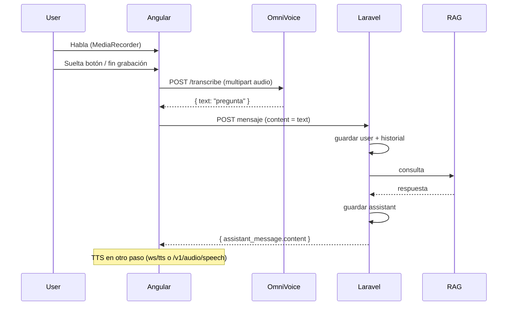

# HTTP STT OmniVoice — `POST /transcribe`

Guía para integración en **Angular** (reemplazo recomendado de `ws://127.0.0.1:3900/ws/transcribe` cuando no se necesitan transcripciones parciales en vivo).

**URL:** `http://127.0.0.1:3900/transcribe`  
**Método:** `POST`  
**Content-Type:** `multipart/form-data`

Implementación de referencia en el servidor: `backend/api/routers/capture.py`  
Uso en la app oficial (fallback): `frontend/src/components/CaptureWidget.jsx` → `sendForTranscription()`.

---

## Por qué usar HTTP en lugar del WebSocket

| | `POST /transcribe` | `ws://.../ws/transcribe` |
|--|-------------------|--------------------------|
| Tiempo hasta texto final | **Una** inferencia al terminar de grabar | Similar, pero puede haber trabajo extra por `partial` cada ~2 s |
| Complejidad en Angular | Baja (`fetch` + `FormData`) | Media (WS, binario, `EOF`, parciales) |
| Texto en vivo mientras habla | No | Sí (`type: "partial"`) |
| Recomendado para | Flujo voz → **Laravel** → TTS | UI tipo dictado con subtítulos en tiempo real |

Para el flujo conversacional con backend **Laravel** (historial + RAG), usar **`POST /transcribe`** es la opción preferida: al soltar el mic se sube el audio, se obtiene `text` y ese string va a Laravel.

---

## Qué hace este endpoint

Convierte **un archivo de audio completo** en **texto**. Es el paso **“usuario habló → obtengo la pregunta en string”**.

- **No** genera voz (TTS).
- **No** llama al RAG.
- **No** guarda historial.

El campo **`text`** de la respuesta JSON es el que debe enviarse a **Laravel** (ej. `POST /api/conversations/{id}/messages`).

---

## Request

### Formato

`multipart/form-data` con al menos el campo de archivo **`audio`**.

| Campo | Tipo | Obligatorio | Descripción |
|-------|------|-------------|-------------|
| `audio` | archivo | **Sí** | Grabación completa (WebM, WAV, M4A, etc.) |
| `language` | string | No | Pista de idioma; el servidor **auto-detecta** en la práctica |
| `mode` | string | No | `fast` (default) o `accurate` |
| `model` | string | No | Legacy; **ignorado** en la arquitectura actual |

### Modo `mode`

- **`fast`** (default, recomendado): motor más rápido para dictado — en Apple Silicon suele ser **MLX Whisper Turbo** (`get_capture_asr_backend`). Sin alineación palabra a palabra (~30 % menos latencia).
- **`accurate`**: WhisperX con alineación; más lento; solo si necesitas timestamps finos por palabra.

**No enviar** `mode=accurate` en el asistente de voz salvo requisito explícito.

### Formatos de audio aceptados

El servidor guarda el upload en disco y lo procesa (conversión vía ffmpeg si hace falta). En el navegador, lo habitual es:

- **`audio/webm`** (Opus) desde `MediaRecorder` — mismo patrón que la app oficial (`capture.webm`).

También suelen funcionar WAV, M4A, etc. si ffmpeg está disponible en el servidor.

### Ejemplo cURL

```bash
curl -X POST http://127.0.0.1:3900/transcribe \
  -F "audio=@grabacion.webm;type=audio/webm" \
  -F "mode=fast"
```

### Ejemplo Angular (después de grabar con MediaRecorder)

```typescript
const blob = new Blob(recordedChunks, { type: 'audio/webm' });
const formData = new FormData();
formData.append('audio', blob, 'utterance.webm');
formData.append('mode', 'fast');

const res = await fetch('http://127.0.0.1:3900/transcribe', {
  method: 'POST',
  body: formData,
});

if (!res.ok) {
  const err = await res.json().catch(() => ({}));
  throw new Error(err.detail ?? `HTTP ${res.status}`);
}

const data = await res.json();
const preguntaUsuario = data.text; // → enviar a Laravel
```

---

## Response

**Content-Type:** `application/json`

### Éxito (200)

```json
{
  "text": "¿Cuál es la hora?",
  "segments": [
    { "start": 0.0, "end": 1.5, "text": "¿Cuál es la hora?" }
  ],
  "language": "es",
  "duration_s": 1.5,
  "transcription_time_s": 0.8,
  "engine": "mlx-whisper"
}
```

| Campo | Uso en Angular / Laravel |
|-------|---------------------------|
| **`text`** | **Campo principal** — mensaje del usuario para Laravel y RAG |
| `segments` | Opcional: UI con tiempos por frase |
| `language` | Idioma detectado |
| `duration_s` | Duración del audio hablado (s) |
| `transcription_time_s` | Tiempo de inferencia ASR (s) — útil para métricas |
| `engine` | Motor usado (ej. `mlx-whisper`) |

Si no hay voz o el audio es inválido, `text` puede ser `""` con `duration_s: 0`.

### Errores

- **422 / 400**: validación FastAPI (falta `audio`, etc.).
- **500**: fallo ASR/ffmpeg; cuerpo puede incluir `detail`.

Tratar `!response.ok` y mostrar error al usuario; opcional reintento.

---

## Secuencia en el flujo de la app



### Pseudocódigo del turno de voz

```typescript
async function turnoVoz(audioBlob: Blob, conversationId: string) {
  // 1. STT — OmniVoice HTTP (NO WebSocket)
  const { text: pregunta } = await transcribeHttp(audioBlob);
  if (!pregunta?.trim()) return;

  // 2. Chat — Laravel (obligatorio)
  const { assistant_message } = await laravel.sendMessage(conversationId, {
    content: pregunta,
    source: 'voice',
  });

  // 3. TTS — OmniVoice (WS o HTTP, documentación aparte)
  await reproducirRespuesta(assistant_message.content);
}
```

---

## Flujo de grabación recomendado en Angular

1. Usuario pulsa “hablar” (gesto de usuario → permiso de mic).
2. `getUserMedia` + `MediaRecorder` con `audio/webm;codecs=opus` si está soportado.
3. `recorder.start(250)` — ir acumulando chunks en un array.
4. Usuario suelta → `recorder.stop()`, parar tracks del stream.
5. `new Blob(chunks, { type: 'audio/webm' })`.
6. **`POST /transcribe`** con ese blob.
7. Mostrar estado “Transcribiendo…” mientras espera (típico 0.5–3 s en Mac M4).
8. Con `text` → llamar Laravel.

**No** abrir `ws/transcribe` en paralelo si se adopta este flujo (evita doble trabajo en GPU).

---

## UI durante la grabación (sin WebSocket)

El HTTP **no** devuelve parciales. Mientras graba, mostrar solo:

- “Escuchando…”
- Indicador de nivel de mic (opcional)
- Temporizador

El texto provisional solo puede venir de **otra** fuente (no de este endpoint). Tras `POST /transcribe`, mostrar `text` o enviarlo directo a Laravel.

---

## Comparación rápida con `ws/transcribe`

| Aspecto | `POST /transcribe` | `ws/transcribe` |
|---------|-------------------|-----------------|
| Protocolo | HTTP multipart | WebSocket |
| Envío de audio | Un archivo al final | Chunks + `EOF` |
| Respuesta parcial | No | `{"type":"partial","text":"..."}` |
| Respuesta final | Mismo JSON que `final` del WS | `{"type":"final",...}` |
| Campo para Laravel | `text` | `final.text` |
| Documentación | Este archivo | `docs/ws-transcribe.md` |

La forma del JSON de resultado es **equivalente** al mensaje `final` del WebSocket (mismos campos útiles).

---

## Requisitos y rendimiento

- OmniVoice escuchando en **`http://127.0.0.1:3900`** (`GET /health`).
- Motor ASR cargado (MLX Whisper en Apple Silicon recomendado).
- **ffmpeg** en PATH del servidor ayuda a convertir WebM → WAV.
- Mantener el backend **caliente** (no reiniciar uvicorn entre turnos) reduce latencia.
- Audio **corto y claro** → menos `transcription_time_s`.
- El cuello de botella global suele ser **Laravel/RAG** o **TTS**, no este POST.

---

## Checklist de aceptación para la otra IA

- [ ] Tras soltar el mic, se hace **un solo** `POST /transcribe` con `FormData` y campo `audio`.
- [ ] Se usa `data.text` para el `POST` a Laravel (no llamar al RAG desde Angular si Laravel es dueño del historial).
- [ ] `mode=fast` por defecto; no usar `accurate` sin motivo.
- [ ] Manejo de `!res.ok` y `text` vacío.
- [ ] No usar `ws/transcribe` en el mismo flujo salvo requisito de subtítulos en vivo.
- [ ] TTS sigue siendo paso separado (`/v1/audio/speech` o `/ws/tts`).

---

## Variables de entorno

No aplican al endpoint HTTP (solo al WebSocket streaming: `OMNIVOICE_STREAM_INTERVAL`, `OMNIVOICE_STREAM_SILENCE`).
